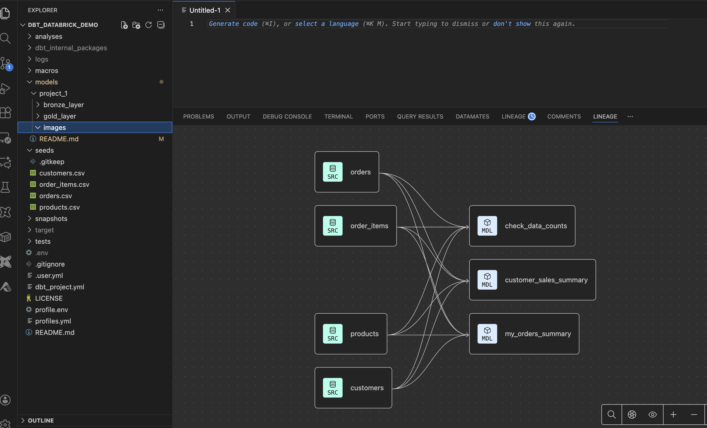

## Features
    1. Multi Environment Support
    2. ci/cd pipeline support
    3. Load Data from External source 
    4. Gold Layer for Business

## 🚀 Project Overview


```
The project simulates a small e-commerce dataset:

Customers
Orders
Products
Order items
It demonstrates:

🗂 dbt seed → Load CSV files into SQLite
🧮 SQL transformations → Stage, join, aggregate
🧪 Data tests → Record counts and validation
📊 Analytics outputs → Customer-level summaries
⚙️ Modular model design → Reusable SQL
🔄 CI-ready structure → dbt run, dbt ls, dbt test

```

## 🧩 Architecture / Data Flow

    CSV Seeds → dbt seed → Transform Models → Summary Models → Outputs


## 📁 Project Structure
    dbt_databrick_demo/
    │
    ├── seeds/
    │   ├── customers.csv
    │   ├── products.csv
    │   ├── orders.csv
    │   └── order_items.csv
    │
    ├── models/
    │   └── example/
    │       ├── my_orders_summary.sql
    │       ├── customer_sales_summary.sql
    │       └── check_data_counts.sql
    │
    ├── dbt_project.yml
    └── README.md

## Commands
    >>> source .env
    >>> dbt seed (first time create table)
    for production
    >>> dbt seed --target project1_prod 

    >>> dbt run --select project_1 (run project_1)

    >>> dbt run --select project_1 --target project1_prod

## Output
```
select * from unified_data_platform_prod.bronze.products

-- before running the job
select * from unified_data_platform_prod.gold.check_data_counts

-- table_name	record_count
-- customers	3
-- order_items	4
-- orders	3
-- products	3


-- after inserting the records
insert into unified_data_platform_prod.bronze.products(product_id, name, category,price)
values(4, 'product4', 'category4',1200);
-- trigger databricks dbt job and test the records
select * from unified_data_platform_prod.gold.check_data_counts

-- table_name	record_count
-- customers	3
-- order_items	4
-- orders	3
-- products	3
```